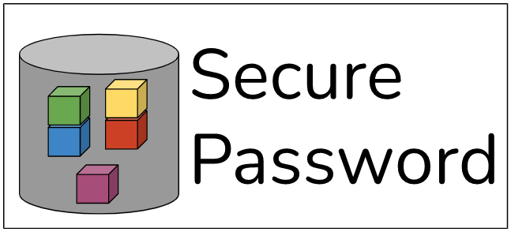

 
  

<h1 align="center"> Secure Password </h1>
<h3 align="center"> A Tool to Save Your Passwords in Your PC Securily </h3>  
<h3 align="center"> End to Forget Passwords </h3>  

 

<!-- TABLE OF CONTENTS -->
<h2 id="table-of-contents"> Table of Contents</h2>

  
Table of Contents

  <ol>
    <li><a href="#about-the-project"> ➤ About The Project</a></li>
    <li><a href="#prerequisites"> ➤ Prerequisites</a></li>
    <li><a href="#folder-structure"> ➤ Folder Structure</a></li>
    <li><a href="#arguments-details"> ➤ Arguments Details</a></li>
    <li><a href="#how-to-use"> ➤ How to Use</a></li>
    <li><a href="#limitations"> ➤ Limitations</a></li>
    <li><a href="#license"> ➤ License</a></li>
  </ol>

<!-- ABOUT THE PROJECT -->
<h2 id="about-the-project"> About The Project</h2>

 
  This project's aim is to manage (see/set/get) passwords in your local environment.
  As a humen being, I generally forget my password because there are a lot. Since most of the passwords are saved by browsers nowadays, I still need this because mobile device passwords such as icloud or banking passwords. So, I decided to write this application.
  
  This application's abilities are;

  * save a keyword-password pair
  * dump keyword-password pair
  * remove keyword-password pair
  * all passwords are guarded by a aes key that will be decided by you
  * also, this application requires 'sudo' privilege
  * while removing or adding a password, the application gets final approval from you
  * so, it is secure

<!-- PREREQUISITES -->
<h2 id="prerequisites"> Prerequisites</h2>

  
  
  
  

Also, following applications are used with system commands in this application.

* pstree
* grep
* head
* sed
* echo

<!-- FOLDER STRUCTURE -->
<h2 id="folder-structure"> Folder Structure</h2>

    code
    .
    │
    ├── pictures
    │   ├── secpwd.png
    │
    ├── LICENSE
    ├── main.c  
    ├── main.h    
    ├── Makefile 
    ├── README.md
    ├── Config

* pictures folder: contains pictures used in the README.md file.
* LICENSE file: contains license information
* main.c and main.h files: are source codes
* Makefile: makefile to compile the program
* README.md file: readme itselt
* Config file: used to open debug option of the application while compiling  

<!-- ARGUMENTS -->
<h2 id="arguments-details"> Arguments' Details</h2>

    

	--version 	(-v): show version

	--name    	(-n): reminder keyword of your password. Eg: github_pwd
		Requires argument
		Should be used with '--pwd' argument

	--pwd     	(-p): password itself
		Requires argument
		Should be used with '--name' argument

	--dump    	(-d): dump passwords
		Optional argument
		If used without any argument then prints all passwods.
		If used with any string argument then prints all similar 'named' passwords

	--remove  	(-r): remove specified 'named' password
		Requires argument

<!-- HOWTO -->
<h2 id="how-to-use"> How to Use</h2>

1. First, you need to change 'key' and 'iv' in 'main.c'
2. Then, you need to compile the program
> make clean all
3. Then, you may start to use the application like below
> sudo ./spwd -n hello -p 123123

> sudo ./spwd -d hel

> sudo ./spwd -r hell

<!-- LIMITS -->
<h2 id="limitations"> Limitations</h2>

All limitations are numeric and can be modified in "main.h" file.

* MAX_LINE_SIZE:      Used to limit one password's max lenght
* MAX_FILE_SIZE:      Used to limit file size of the file contains encrypted passwords

<!-- LICENSE -->
<h2 id="license"> License</h2>

<h3 align="left"> This project is completely FREE </h3>
